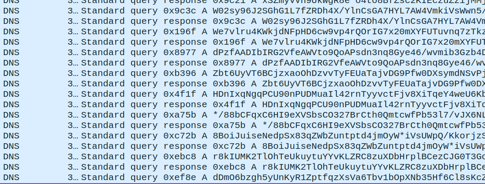
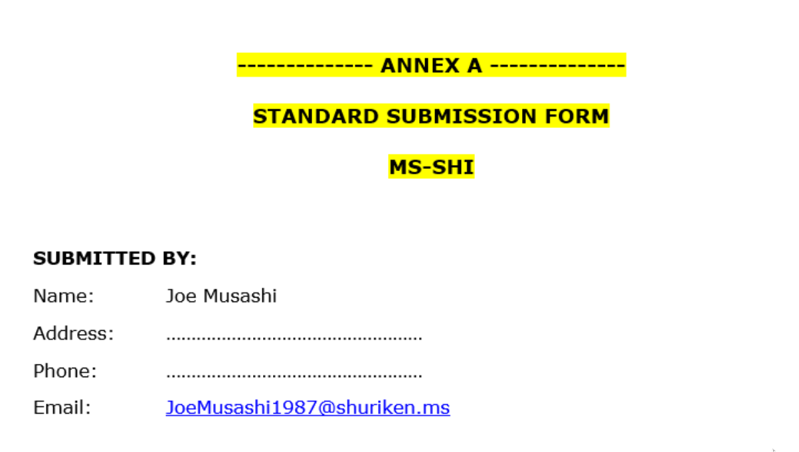

# ¿Qué pasa en mi VLAN?
In this CTF challenge, our task is to analyze a network traffic capture to identify the email of a client affected by an intrusion.

**Disclaimer**: The purpose of this document is purely educational. It is intended to demonstrate cybersecurity techniques within a controlled environment, such as a Capture The Flag (CTF) competition. Any misuse of the information provided herein for unauthorized or illegal activities is strictly prohibited and is not the responsibility of the author. Moreover, I believe that I am not violating any rules by uploading these challenge solutions. However, if you find any content here that you think violates any rules, please contact me, and I will address the issue promptly.

When we open the traffic capture with Wireshark, we can see what appears to be data being exfiltrated through DNS packets.



We can obtain this queries using tshark from the terminal:

```
tshark -r capture.pcapng -T fields -e dns.qry.name -Y "dns.flags == 0x0120" > queries.txt
```

Next, we use Python to decode the encoded content. At first glance, the encoding algorithm seems to be base64, but there are illegal symbols such as "*" used. So, we need to replace them with either nothing or a symbol legal in base64.

```python
content = open("queries.txt","r").read()
content = content.replace("-.000","")
content = content.replace("-.","")
content = content.replace("*","+")
content = content.replace("\n","")
result = b64decode(content)
out = open("result","wb")
out.write(result)
out.close()
```

The result is a gzip file containing a compressed file named **000**, which in turn contains a file named **dHJvbgo.jpg**. This last file appears to be a simple image. However, with further analysis, we find what we were looking for.

```
binwalk -D "pdf" dHJvbgo.jpg
```


