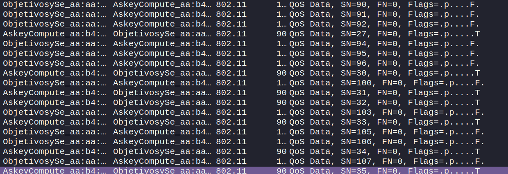

# Wireless John Snow
In this CTF, our task is to analyze a network traffic capture. We are tracking a user named John Snow who is connecting to the company's FTP server. Our objective is to obtain his credentials.

**Disclaimer**: The purpose of this document is purely educational. It is intended to demonstrate cybersecurity techniques within a controlled environment, such as a Capture The Flag (CTF) competition. Any misuse of the information provided herein for unauthorized or illegal activities is strictly prohibited and is not the responsibility of the author. Moreover, I believe that I am not violating any rules by uploading these challenge solutions. However, if you find any content here that you think violates any rules, please contact me, and I will address the issue promptly.


When we open the traffic capture with Wireshark, we can see that it is a WiFi traffic capture. This is evident from the protocol column, where the 802.11 protocol is listed.



However, there is a challenge: the traffic is encrypted. To analyze the capture, we first need to decrypt it. This requires ensuring that the handshake has been captured.


I will use the aircrack-ng suite and the rockyou wordlist for this purpose.

```
aircrack-ng capture.cap -w ./rockyou.txt
```

This command will find the password.


Now that we have the password, we can use airdecap to decrypt the pcap file. Additionally, we need the SSID, which can be found by examining the probe responses.


```
airdecap-ng -e Earthrealm -p "sysadmin1" capture.cap
```

Once the pcap is decrypted, we can analyze the decrypted traffic. The credentials are sent in plaintext.


