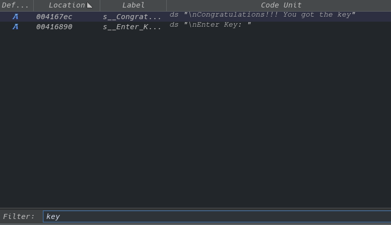
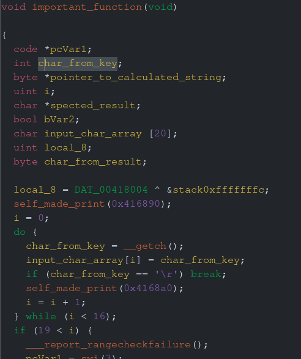
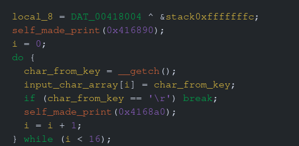
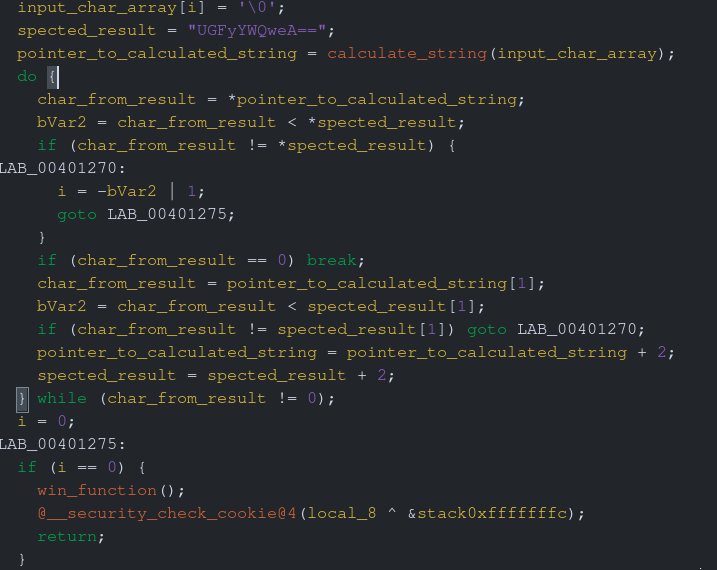

# Saint Seiya
In this challenge we are asked to find the key in a executable.

**Disclaimer**: The purpose of this document is purely educational. It is intended to demonstrate cybersecurity techniques within a controlled environment, such as a Capture The Flag (CTF) competition. Any misuse of the information provided herein for unauthorized or illegal activities is strictly prohibited and is not the responsibility of the author. Moreover, I believe that I am not violating any rules by uploading these challenge solutions. However, if you find any content here that you think violates any rules, please contact me, and I will address the issue promptly.

When we run the executable, we are presented with the following prompt:

```
Enter Key: 
```

Entering a random password and pressing execute yields no result:

```
Enter Key: **** 
```

Let's analyze the executable with Ghidra. I begin by searching for the prompt string:




This search reveals the prompt and also the prompt for the correct key. I follow the first string to start analyzing the executable's functions. After some renaming, the decompiled code looks like this:



Let's delve into the code. In the first section, the program saves the entered characters into a char array. The **self_made_print** function is simply a print function. If enter is pressed, the program exits the loop.



In the second section, we see what appears to be the expected password, which is base64 encoded. Next, a function is called with the input password. The result is saved into a variable and then compared character by character with the expected password. If all characters match, the win function is called. The win function just prints **"Congratulations!!! You got the key"**



When we analyze the **calculate_string** function, we find it is quite complex. However, given that the expected password is base64 encoded and the input password is transformed by this function before being compared with the base64 encoded expected password, it is likely that this function encodes the text into base64.


**Parad0x** is the result from decoding **GFyYWQweA==**, the expeted password.

```
Enter Key: *******
Congratulations!!! You got the key
```
